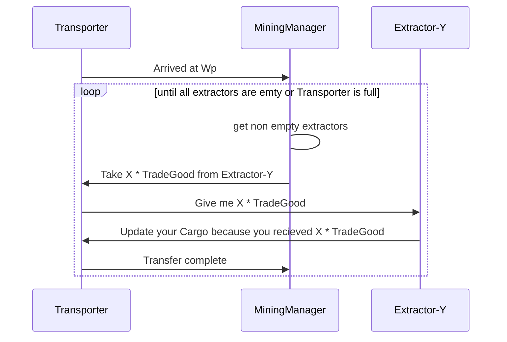
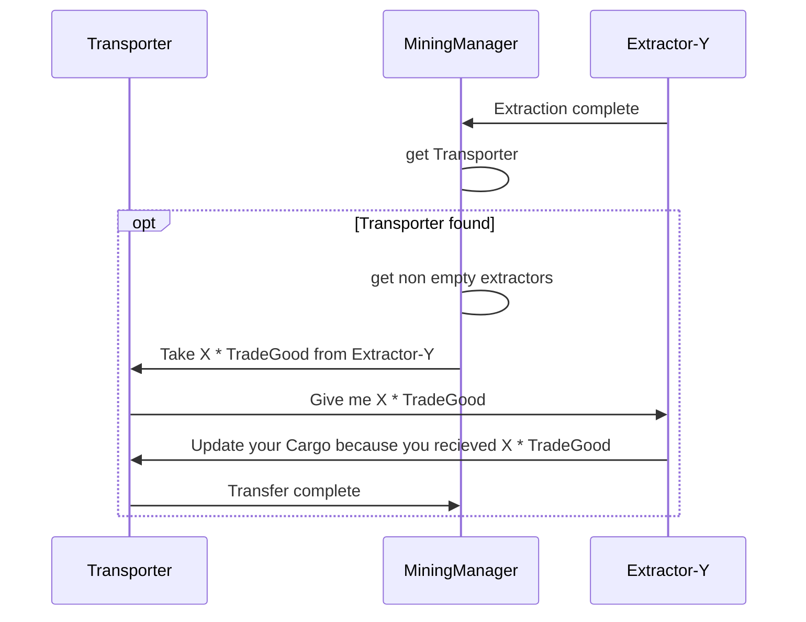

## Mining Manager visualization

When a transporter arrives at a waypoint

```mermaid
sequenceDiagram
    participant Transporter
    participant MiningManager
    participant Extractor-Y
    Transporter ->> MiningManager: Arrived at Wp
    loop until all extractors are emty or Transporter is full
        MiningManager -> MiningManager: get non empty extractors
        MiningManager ->> Transporter: Take X * TradeGood from Extractor-Y
        Transporter ->> Extractor-Y: Give me X * TradeGood
        Extractor-Y ->> Transporter: Update your Cargo because you recieved X * TradeGood
        Transporter ->> MiningManager: Transfer complete
    end
```

Whern a completed an extraction

```mermaid
sequenceDiagram
    participant Transporter
    participant MiningManager
    participant Extractor-Y
    Extractor-Y ->> MiningManager: Extraction complete
    MiningManager -> MiningManager: get Transporter
    opt Transporter found
        MiningManager -> MiningManager: get non empty extractors
        MiningManager ->> Transporter: Take X * TradeGood from Extractor-Y
        Transporter ->> Extractor-Y: Give me X * TradeGood
        Extractor-Y ->> Transporter: Update your Cargo because you recieved X * TradeGood
        Transporter ->> MiningManager: Transfer complete
    end
```