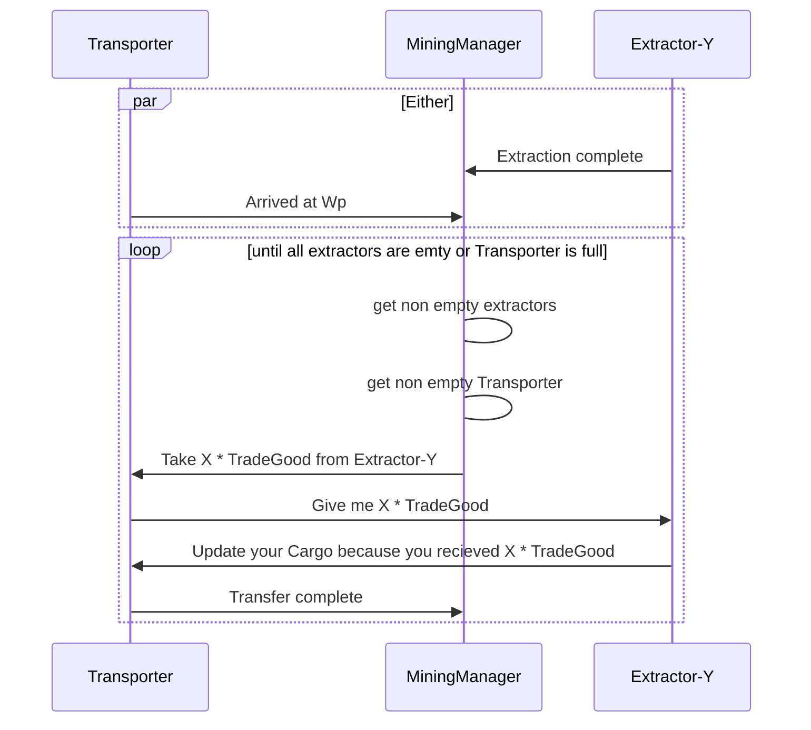

## Mining Manager visualization

## Todo
- update budgeting system to include ship transfers
- rework Manuel control
- update mining transfer system
- speed up ShipProcurementManager
- connect transactions with fleets
- fix marketTransactionSummary fuel display
- rewrite database provider to properly use inversion of controle