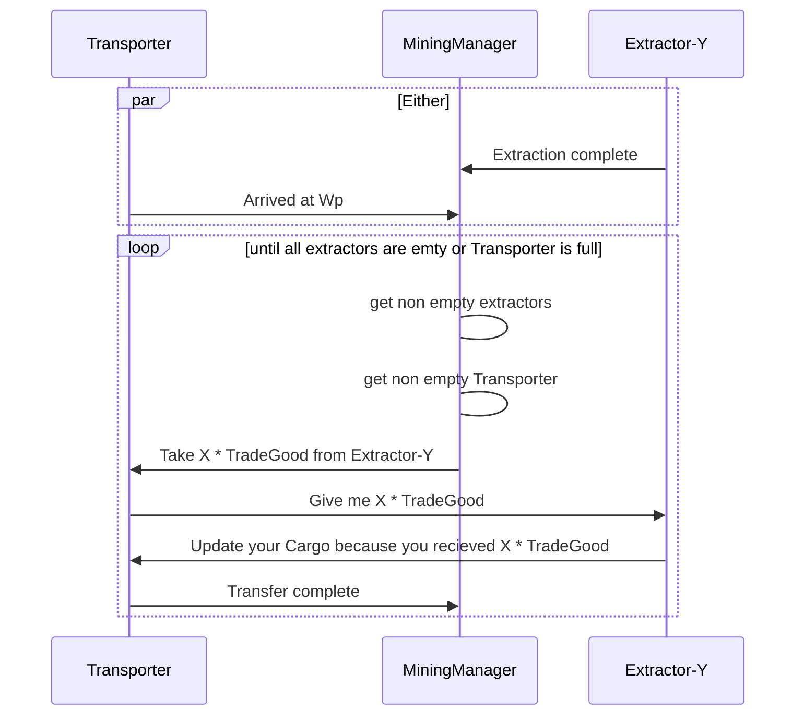

## Running

The client is configured via environment variables (loaded from `.env` via `dotenvy`):

- `DATABASE_URL` – PostgreSQL connection string (required)
- `READYSET_URL` – optional ReadySet connection string
- `SOCKET_ADDRESS` – address the control API listens on (default `0.0.0.0:8780`)
- `ACCOUNT_TOKEN` – SpaceTraders account token (required for a normal run)
- `AGENT_SYMBOL` – agent symbol (default `MOOSBEE`)
- `CONTROL_API_ONLY` – set to `true` (or `1`) to start only the GraphQL control API server. In this mode the SpaceTraders API is never contacted and no agent, managers or pilots are started.

Example:

```sh
CONTROL_API_ONLY=true cargo run --release
```

## Mining Manager visualization


```mermaid
sequenceDiagram
    participant Transporter
    participant MiningManager
    participant Extractor-Y
    par Either
      Extractor-Y ->> MiningManager: Extraction complete
      Transporter ->> MiningManager: Arrived at Wp
    end
    loop until all extractors are emty or Transporter is full
        MiningManager -> MiningManager: get non empty extractors
        MiningManager -> MiningManager: get non empty Transporter
        MiningManager ->> Transporter: Take X * TradeGood from Extractor-Y
        Transporter ->> Extractor-Y: Give me X * TradeGood
        Extractor-Y ->> Transporter: Update your Cargo because you recieved X * TradeGood
        Transporter ->> MiningManager: Transfer complete
    end
```

## Todo
- update budgeting system to include ship transfers
- rework Manuel control
- update mining transfer system
- speed up ShipProcurementManager, rewrite it to no longer block scrappers on shipyards
- add a static scrapping for shipyards
- add a fleet priority to prioritise better systems with population
- add a filter to stop population of useless systems(trading and scrapping fleets based on market opportunities)
- connect transactions with fleets
- rewrite database provider to properly use inversion of control